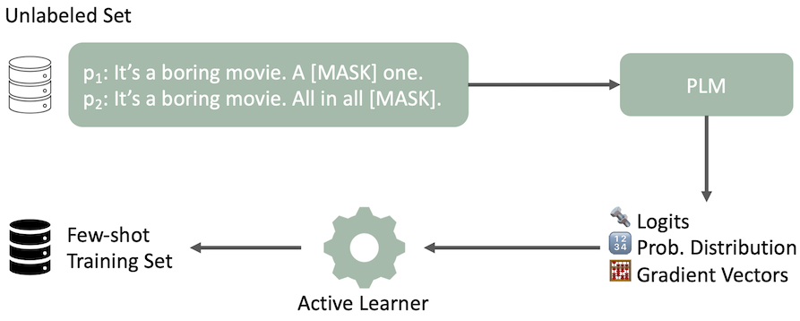

# MEAL: Stable and Active Learning for Few-Shot Prompting

The code and data for our EMNLP 2023 Findings paper: MEAL ([paper](https://arxiv.org/abs/2211.08358)). 

  

Our key-findings are:
1. Prompt-based fine-tuning faces major instability issues related to *run variability* and *training data selection*. See the figure above, the accuracy may vary **from 52\% to 78\%**.
2. Multiprompt finetuning and ensembling techniques improve the run variability significantly (see Table 1 in the [paper](https://arxiv.org/abs/2211.08358)).
3. We evaluate various active-learning / data selection strategies to attack variability of training data selection. We propose a novel strategy, IPUSD, relying on variance across different prompts. IPUSD outperforms other active learning strategies both in terms of accuracy and variance (see the table below).

## Few-shot Active Learning / Data Selection Strategies

 
Our modified active learning pipeline for data selection is illustrated with an example sentence and two prompts for sentiment analysis. The PLM outputs several features in a zero-shot manner. AL selects a few-shot training set based on these output features.

## Results

|              | Acc ↑    | Rank ↓ | Div. ↑ | Repr. ↑ | Ent. ↓ |
|--------------|----------|--------|--------|---------|--------|
| [Random](Datasets/Random)       | 72.6±2.8 | 4.0    | **13.6**   | **17.6**    | **2.0**    |
| [Entropy](Datasets/Entropy)      | 70.9     | 6.4    | 13.3   | 16.9    | 6.1    |
| [LC](Datasets/Lowest_Confidence)           | 70.9     | 5.6    | 13.5   | 17.2    | 5.3    |
| [BT](Datasets/Breaking_Ties)           | 72.1     | 4.0    | 13.4   | 17.1    | 5.6    |
| [PP-KL (Ours)](Datasets/PP-KL) | 69.1     | 5.6    | 13.4   | 16.9    | 9.0    |
| [CAL](Datasets/CAL)          | 70.4     | 4.4    | 13.1   | 17.1    | 23.5   |
| [BADGE](Datasets/BADGE)        | 73.2±3.3 | 3.0    | **13.6**   | **17.6**    | 2.2    |
| [IPUSD (Ours)](Datasets/IPUSD) | **73.9**±**2.3** | **3.0**    | 13.5   | **17.6**    | **2.0**    |

IPUSD, our proposed data selection strategy, for few-shot prompting achieves higher accuracy while proposing much lower variance across RTE, SST-2, SST-5, TREC, and MRPC. We show that heuristics like random or highest entropy would lead to much lower performance.

Check out the data splits including unlabeled pool in the Datasets folder.

## Citation
```
@misc{koksal2023meal,
      title={MEAL: Stable and Active Learning for Few-Shot Prompting}, 
      author={Abdullatif Köksal and Timo Schick and Hinrich Schütze},
      year={2023},
      eprint={2211.08358},
      archivePrefix={arXiv},
      primaryClass={cs.CL}
}
```